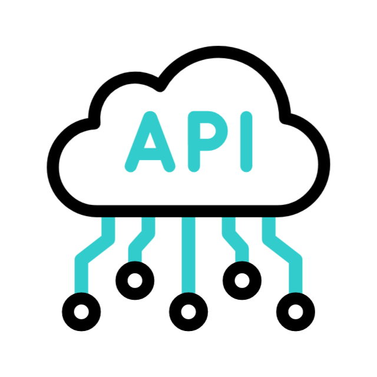

<!-- ## Hi there 👋 -->

  
  

    
    
  

---

## Full Project List

### Web Development

   
  
  
  

### Desktop Application

  

## Languages and Tools

<table>
  <thead>
    <tr>
      <th></th>
      <th></th>
      <th>Years</th>
      <th>Projects</th>
      <th>Level</th>
    </tr>
  </thead>
  <tbody>
    <tr>
      <td>Icon
      </td>
      <td>Python
      </td>
      <td>3
      </td>
      <td>10+
      </td>
      <td>Advanced
      </td>
    </tr>
    <tr>
      <td>Icon
      </td>
      <td>JavaScript
      </td>
      <td>1
      </td>
      <td>9
      </td>
      <td>Intermediate
      </td>
    </tr>
  </tbody>
</table>

<!--
**s-mehnert/s-mehnert** is a ✨ _special_ ✨ repository because its `README.md` (this file) appears on your GitHub profile.

Here are some ideas to get you started:

- 🔭 I’m currently working on ...
- 🌱 I’m currently learning ...
- 👯 I’m looking to collaborate on ...
- 🤔 I’m looking for help with ...
- 💬 Ask me about ...
- 📫 How to reach me: ...
- 😄 Pronouns: ...
- ⚡ Fun fact: ...
-->

### Attributions

<a href="https://www.flaticon.com/free-animated-icons/technology" title="technology animated icons">Technology animated icons created by Freepik - Flaticon</a>